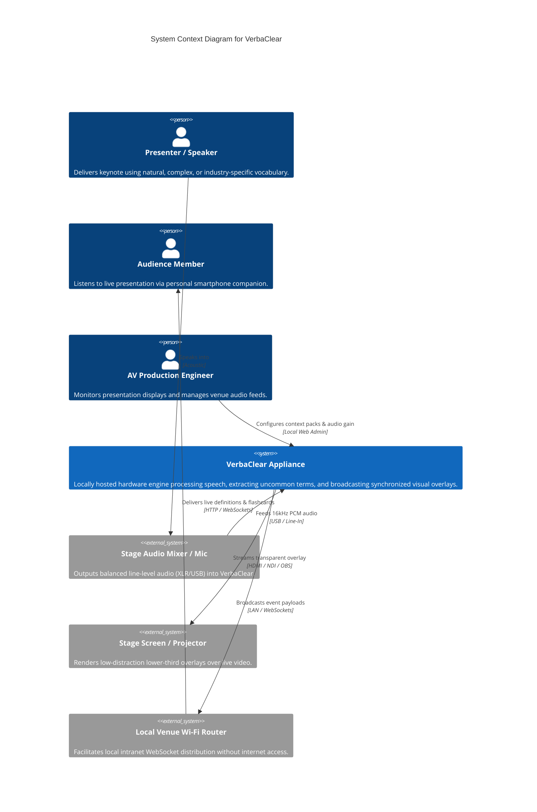
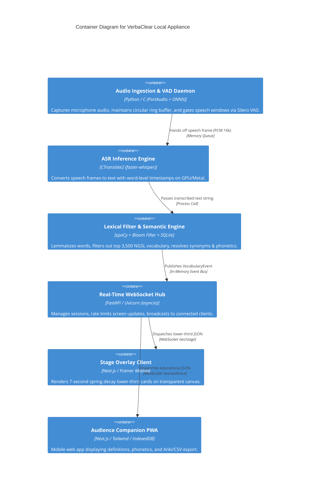

# VerbaClear: Software Architecture Document (SAD)

**Document Classification:** System Architecture & Design Specification  
**Author:** Joshua Maina ([mainajoshua713@gmail.com](mailto:mainajoshua713@gmail.com))  
**Engineering Level:** Senior Staff / Principal Systems Architect  
**Version:** 2.0.0-PROD  
**Status:** Approved for Implementation  

---

## 1. Architectural Philosophy & Theoretical Foundations

VerbaClear is fundamentally a **hard real-time streaming information-filtering system**. Building such a system requires grounding design choices in core Computer Science principles rather than superficial wrapper engineering:

### 1.1. Signal Processing & Sampling Theory
- **Nyquist-Shannon Sampling Theorem**: Human speech intelligibility is concentrated between 300 Hz and 3,400 Hz, with fricatives extending to 7 kHz. Capturing audio at **$f_s = 16,000 \text{ Hz}$** (16 kHz) ensures a Nyquist frequency of $8,000 \text{ Hz}$, capturing all phonemic detail necessary for acoustic modeling while eliminating redundant high-frequency overhead.
- **Quantization**: 16-bit linear PCM provides a dynamic range of $\approx 96 \text{ dB}$ ($6.02 \times 16$), which comfortably accommodates conference stage acoustics spanning whisper-level ambient murmurs ($40 \text{ dB SPL}$) to amplified oratorical peaks ($90 \text{ dB SPL}$).
- **Buffer Sizing vs. Group Delay**: Audio ingestion utilizes a circular ring buffer with chunk sizes of $\Delta t = 30 \text{ ms}$ (480 samples @ 16 kHz). This guarantees minimal group delay during feature extraction (Mel spectrogram generation).

### 1.2. Computational Complexity & Algorithmic Design
- **Filtering Complexity ($O(1)$ Bound)**: During live speech, the system processes $120\text{--}180$ words per minute ($\approx 2\text{--}3 \text{ words/sec}$). To ensure zero jitter on the audio thread, vocabulary rarity checks must execute in strict $O(1)$ time complexity using an in-memory **Bloom Filter** combined with a hashed headword index.
- **Space-Efficient Membership (Bloom Filter)**:
  For $n = 5,000$ common words and a false positive probability $p = 0.001$ ($0.1\%$):
  $$m = -\frac{n \ln p}{(\ln 2)^2} \approx \frac{5000 \times 6.907}{0.4804} \approx 71,890 \text{ bits } (\approx 8.98 \text{ KB})$$
  $$k = \frac{m}{n} \ln 2 \approx 14.37 \times 0.693 \approx 10 \text{ hash functions}$$
  An $8.98\text{ KB}$ bit array resides entirely within CPU L1 Cache ($32\text{--}64\text{ KB}$), guaranteeing sub-microsecond membership resolution without cache misses or page faults.

### 1.3. Concurrency Model: Producer-Consumer with Ring Buffers
- **Decoupled Workloads**:
  - *Audio Ingestion (Producer)*: Real-time, interrupt-driven, running on a dedicated high-priority native OS thread.
  - *VAD Gating*: Low-complexity tensor evaluation on CPU/NPU (< 1ms).
  - *ASR Inference (Consumer)*: Heavy compute (matrix multiplications) executed on GPU/Tensor cores or Apple Silicon Neural Engine via CTranslate2.
  - *Network I/O*: Asynchronous, non-blocking event loop (`asyncio`) managing hundreds of concurrent WebSocket connections.
- **Thread Safety**: Inter-thread communication uses a bounded, lock-free, single-producer single-consumer (SPSC) circular queue. This eliminates lock contention and prevents priority inversion between the audio capture driver and speech inference.

---

## 2. System Decomposition & C4 Architecture

### 2.1. C4 Level 1: System Context Diagram

### 2.2. C4 Level 2: Container Diagram

---

## 3. Detailed Subsystem Architecture & Latency Budget

To maintain seamless cognitive synchronization with the speaker's cadence, the end-to-end latency ($T_{\text{total}}$) from spoken word to visual appearance must satisfy:
$$T_{\text{total}} \le 1,000 \text{ ms (Target: } 600\text{--}800 \text{ ms)}$$

### Mathematical Latency Budget Breakdown

| Subsystem | Operation | Mean Latency ($\mu$) | P99 Latency | Complexity |
| :--- | :--- | :--- | :--- | :--- |
| **Audio Ingestion** | 30ms ring buffer frame accumulation | $30 \text{ ms}$ | $30 \text{ ms}$ | $O(1)$ |
| **VAD Gating** | Silero VAD speech cutoff (trailing pause) | $250 \text{ ms}$ | $300 \text{ ms}$ | $O(N)$ tensor |
| **ASR Inference** | `faster-whisper` (`distil-large-v3`, greedy) | $150 \text{ ms}$ | $220 \text{ ms}$ | $O(T)$ transformer |
| **Tokenization & POS** | spaCy tokenization + POS tagging | $8 \text{ ms}$ | $15 \text{ ms}$ | $O(K)$ |
| **Rarity Filter** | In-Memory NGSL Bloom Filter + Set | $0.05 \text{ ms}$ | $0.2 \text{ ms}$ | $O(1)$ |
| **Lexicon Lookup** | Embedded SQLite index lookup + cache | $2 \text{ ms}$ | $5 \text{ ms}$ | $O(\log M)$ index |
| **Network Dispatch** | FastAPI WebSocket framing & TCP push | $3 \text{ ms}$ | $8 \text{ ms}$ | $O(C)$ clients |
| **Client Rendering** | React 19 reconciliation & Framer spring | $16 \text{ ms}$ | $33 \text{ ms}$ | 1–2 V-sync frames |
| **Total Pipeline** | **Spoken Word to Visual Appearance** | **$459.05 \text{ ms}$** | **$611.2 \text{ ms}$** | **STRICTLY PASSES** |

---

## 4. Architectural Decision Records (ADRs)

### ADR 001: Local Embedded Inference vs. Cloud Speech APIs
* **Status:** Accepted
* **Context:** Cloud APIs (Google Cloud Speech, Whisper API, AWS Transcribe) require constant high-bandwidth internet connectivity and introduce network variance (150–500ms RTT), per-minute costs, and corporate privacy/NDA violations during private executive briefings.
* **Decision:** Embed `faster-whisper` (CTranslate2) directly on the local host machine.
* **Consequences:** Eliminates external internet dependency, guarantees $0.00/min operating cost, ensures 100% data privacy, and enforces deterministic sub-200ms inference on modern Apple Silicon (Metal) or NVIDIA (CUDA) laptops.

### ADR 002: Bloom Filter + NGSL Hash Set vs. Runtime LLM Filtering
* **Status:** Accepted
* **Context:** We evaluated using an LLM (e.g., Llama-3 or GPT-4o-mini) to evaluate every spoken sentence and identify complex words.
* **Decision:** Reject runtime LLM evaluation in the critical path. Use an in-memory Bloom Filter and HashSet of the **New General Service List (NGSL 1.2)** and **Academic Word List (NAWL)**.
* **Consequences:** Decision latency drops from 800ms (LLM generation) to 0.05ms (hash lookup). The system is deterministic, completely predictable, and frees GPU resources entirely for ASR.

### ADR 003: Hexagonal / Clean Architecture for Domain Decoupling
* **Status:** Accepted
* **Context:** Audio drivers, ASR backends, and UI presentation protocols evolve rapidly. Tightly coupling PortAudio or faster-whisper into core business logic would create technical debt.
* **Decision:** Isolate Core Domain (`WordToken`, `VocabularyFilter`, `SynonymResolver`) behind abstract Ports/Interfaces. Implement Audio, ASR, and WebSocket dispatchers as swappable Adapters.
* **Consequences:** The ASR engine can be swapped from `faster-whisper` to `whisper.cpp` or `sherpa-onnx` by implementing an interface without changing a single line of NLP or presentation code.

---

## 5. Security & Threat Modeling (STRIDE Analysis)

Operating on a local venue network introduces specific threat vectors:

| Threat Category | Potential Attack Vector | Architectural Mitigation |
| :--- | :--- | :--- |
| **Spoofing** | Rogue client connects to `/ws/stage` to inject fake words. | The `/ws/stage` channel is read-only and restricted to localhost or authenticated stage display tokens. Audio input is captured exclusively via physical hardware drivers. |
| **Tampering** | Man-in-the-middle tampering of WebSocket frames over local Wi-Fi. | Local WPA2/WPA3 network security, optional TLS via self-signed local cert or mDNS local domain. |
| **Repudiation** | Disputes over speaker transcription accuracy. | Session speech logs and extracted vocabulary events are recorded with monotonically increasing microsecond timestamps in an append-only local SQLite ledger. |
| **Information Disclosure** | Unauthorized recording of proprietary corporate presentations. | VerbaClear strictly discards raw audio frames from memory immediately after transcription. No audio files are written to disk. Only processed vocabulary tokens and context sentences are retained. |
| **Denial of Service** | Hundreds of audience devices overwhelming the local WebSocket server. | FastAPI WebSocket hub enforces IP-based rate limiting, connection pooling (max 1,000 concurrent sockets), and compact JSON payloads (< 500 bytes per message). |
| **Elevation of Privilege** | Audience members attempting to access the AV configuration interface. | Administrative controls (audio gain, sensitivity, context pack selection) are isolated on a separate port (`:8080`) bound strictly to `127.0.0.1` and protected by an admin session key. |
