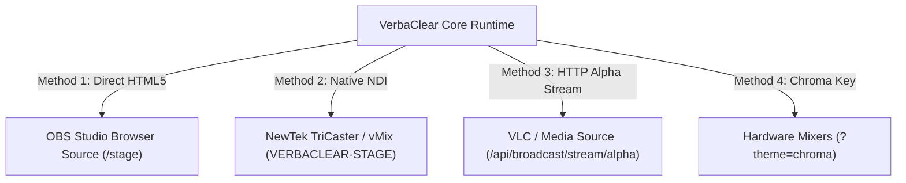

# VerbaClear Broadcast & Video Switcher Integration Guide

**Applies to:** OBS Studio, vMix, NewTek TriCaster, Wirecast, and Hardware Video Mixers (Blackmagic ATEM)  
**Resolution:** 1920x1080 (16:9 Full HD)  
**Transparency:** True 8-Bit Alpha Channel / Chroma Key Green Fallback  

---

## Integration Overview

VerbaClear offers three distinct integration pathways for digital video switchers:



---

## Method 1: OBS Studio Browser Source (Recommended for Local Streams)

1. In OBS Studio, add a new source: **`+` → `Browser`**.
2. Name the source: **`VerbaClear Stage Lower-Third`**.
3. Configure Browser Source settings:
   - **URL:** `http://localhost:8888/stage` (or `http://<LAN_IP>:8888/stage` if running on a separate machine)
   - **Width:** `1920`
   - **Height:** `1080`
   - **Custom CSS:** Clear all default CSS (leave empty).
   - **Shutdown source when not visible:** Checked.
   - **Refresh browser when scene becomes active:** Unchecked.
4. Position the source as the top layer over your main camera or presentation slides.
5. VerbaClear renders with 100% transparent alpha. No color filters or green screen keys are needed.

---

## Method 2: Native NDI Stream (Recommended for Networked Switchers)

VerbaClear outputs an NDI video stream titled `VERBACLEAR-STAGE` at 1080p, 30fps with RGBA alpha:

### On vMix:
1. Click **Add Input** → **NDI / Desktop Capture**.
2. Select **`VERBACLEAR-STAGE`** from the list of network NDI sources.
3. Assign the input to an **Overlay Channel** (e.g. Overlay 1 or 2).
4. Lower-third cards appear with full alpha transparency.

### On OBS Studio (with obs-ndi plugin):
1. Install the `obs-ndi` plugin from the OBS project.
2. In OBS, click **`+` → `NDI Source`**.
3. In Source Name, select **`VERBACLEAR-STAGE`**.
4. Set **Bandwidth:** `Highest`.
5. Place the layer above your presentation slide sources.

---

## Method 3: HTTP Multipart Alpha Video Stream

For switchers or media players that ingest network streams without installing NDI drivers:
- **Stream URL:** `http://<LAN_IP>:8888/api/broadcast/stream/alpha`
- **MIME Type:** `multipart/x-mixed-replace; boundary=frame`
- **Format:** High-speed PNG chunks preserving full 8-bit alpha channel transparency.
- **Still Frame Grab:** `http://<LAN_IP>:8888/api/broadcast/frame`

---

## Method 4: Hardware Mixers (Chroma Key Green Fallback)

For legacy hardware production switchers (e.g. Blackmagic ATEM Television Studio) requiring a green screen video feed:
1. Open the stage display with the chroma theme parameter:
   ```
   http://<LAN_IP>:8888/stage?theme=chroma
   ```
2. The transparent background is converted to pure `#00FF00` chroma green.
3. On your video switcher, configure an **Upstream Keyer** → **Chroma** targeting `#00FF00`.
