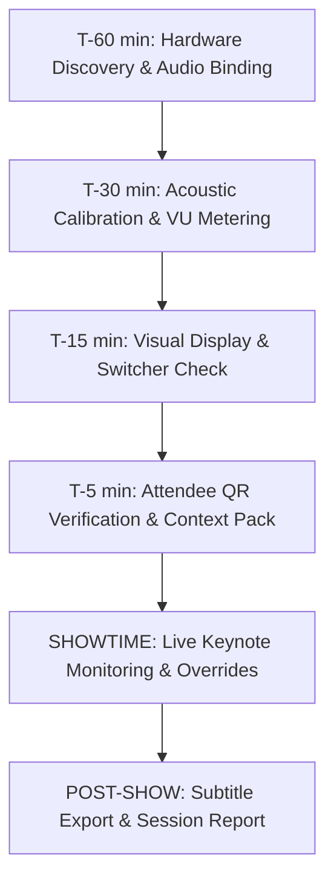

# VerbaClear AV Sound Booth Operator Runbook

**Target Audience:** Audio Engineers, Production Technicians, and AV Operators  
**System:** VerbaClear Live Event Speech Intelligence Appliance  
**Version:** 1.0.0  

---

## 1. Quick Launch & URLs

Start the appliance from the project root:
```bash
# Automatically detects available port (defaults to 8888 if 8000 is occupied):
./scripts/run_appliance.sh

# Or launch via the Python CLI with live audio:
source .venv/bin/activate
python -m src.interfaces.cli start --port 8888
```

### Operational URLs
| Surface | Purpose | URL |
| :--- | :--- | :--- |
| **AV Operator Control Room** | Primary sound booth dashboard | `http://localhost:8888/admin` |
| **Stage Lower-Third Overlay** | Full HD display / OBS Browser Source | `http://localhost:8888/stage` |
| **Audience Companion Portal** | Attendee smartphone notebook | `http://<LAN_IP>:8888/companion` |
| **Venue Dynamic QR Code** | On-screen or printed QR code | `http://<LAN_IP>:8888/api/session/qr` |
| **Live Transparent Video Stream** | OBS / vMix HTTP alpha feed | `http://localhost:8888/api/broadcast/stream/alpha` |
| **1080p Alpha Frame PNG** | Single frame grab | `http://localhost:8888/api/broadcast/frame` |

---

## 2. Event Day Countdown Checklist



### T-60 Minutes: Hardware Discovery
1. Connect all USB audio interfaces (Focusrite, Behringer, Dante Virtual Soundcard, Rode Wireless).
2. Run hardware discovery:
   ```bash
   python -m src.interfaces.cli devices
   ```
3. Identify the target input device index (e.g. `[13] default` or `[0] Focusrite Scarlett 2i2`).
4. Launch VerbaClear binding to that index:
   ```bash
   python -m src.interfaces.cli start --device-index 0 --port 8888
   ```

### T-30 Minutes: Acoustic Calibration & VU Metering
1. Open `http://localhost:8888/admin` on the sound booth monitor.
2. Verify signal flow on the **Signal Oscilloscope** and **VU Meter**:
   - **Noise Floor:** Should rest below **-48 dBFS** in silence.
   - **Nominal Vocal Level:** Spoken speech should peak between **-18 dBFS and -6 dBFS**.
   - **Silero VAD Pill:** Must stay gray (`Silence / Noise Gate`) during ambient room murmur, turning cyan (`Speaking Detected`) within **30ms** of presenter speech.

### T-15 Minutes: Visual Display & Switcher Alignment
1. Open `/stage` on the secondary display (projector / confidence monitor) or add as an OBS Browser Source.
2. Press **[F11]** on the stage display browser to enter fullscreen borderless mode.
3. Test a test card injection in `/admin`:
   - Word: `LABYRINTHINE`
   - Synonyms: `Highly Complex, Maze-like`
   - Definition: `Intricate or complicated in structure`
4. Confirm the lower-third card animates into view smoothly, holds for 7 seconds with decay countdown bar, and fades out cleanly.

### T-5 Minutes: Attendee QR Verification & Context Pack
1. Scan the QR code displayed at `http://<LAN_IP>:8888/api/session/qr` with a smartphone connected to the venue Wi-Fi.
2. Confirm the mobile companion portal loads instantly.
3. Select the appropriate **Domain Context Pack** (e.g., `FinTech`, `AI`, `Medical`, `Legal`, or `General Baseline`) and click **Activate Pack**.
4. Set the **Vocabulary Sensitivity Slider** to match audience demographics:
   - **B1**: General public, multi-lingual, or ESL audiences (highest simplification).
   - **B2**: Standard keynote baseline (default).
   - **C1**: Advanced professional / executive audiences.
   - **C2**: Specialized academic / technical symposiums.

---

## 3. Live Event Operator Hotkeys

The AV Operator Console (`/admin`) features physical keyboard shortcuts for split-second reaction:

| Key Shortcut | Action | Description |
| :---: | :--- | :--- |
| **`[ESC]`** | **Stage Blackout** | Instantly blanks the stage overlay and purges all queued vocabulary cards. Use during unexpected speaker moments, technical pauses, or Q&A. |
| **`[SPACE]`** | **Dismiss Current Card** | Skips the active lower-third card early, immediately popping the next queued card. |
| **`[M]`** | **Mute / Unmute Audio** | Pauses ASR transcription while keeping hardware VU metering active. |

---

## 4. Post-Event Operations & Media Export

Immediately following the session:
1. In `/admin` under **Session Intelligence & Subtitle Transcripts**:
   - Click **Export WebVTT (.vtt)** for video players and web streaming.
   - Click **Export SubRip (.srt)** for Premiere Pro, Final Cut, and DaVinci Resolve editors.
   - Click **Export Plain Text (.txt)** for conference summaries and press releases.
   - Click **Executive Report (.json)** for vocabulary simplification rate, Type-Token Ratio (TTR), and speech analytics.
2. Back up attendee bookmark decks via the mobile companion **Export Anki (.apkg)** button.
