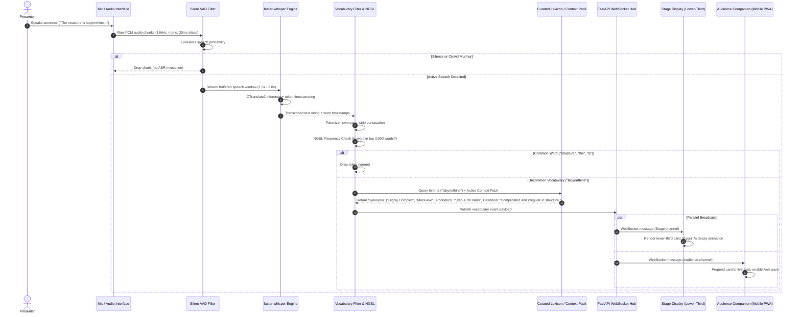
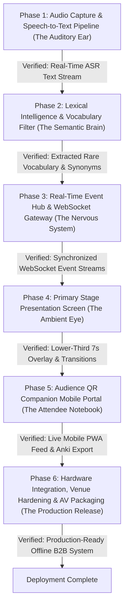

# VerbaClear: Comprehensive System Architecture & Engineering Specification

**Document Version:** 1.0.0  
**Target Author:** Joshua Maina ([mainajoshua713@gmail.com](mailto:mainajoshua713@gmail.com))  
**Project Scope:** Ambient, Real-Time AI Vocabulary Simplification & Live Event Accessibility Platform  

---

## 1. Executive Summary & Problem Space

Live corporate keynotes, academic symposiums, legal panels, and technical conferences frequently suffer from **cognitive impedance**:
- Speakers inadvertently use elevated diction, esoteric idioms, and hyper-specialized acronyms.
- Non-native English speakers, neurodivergent attendees, and junior professionals experience cognitive overload, distraction, or fatigue trying to parse unfamiliar terminology while following the presentation.
- Traditional solutions fall short:
  - **Full live captions (Zoom / Otter.ai):** Generate visual clutter with dense walls of scrolling text that compete with the speaker for visual attention.
  - **Live translation (Wordly.ai):** Solves cross-lingual translation (e.g., English to French) but introduces severe auditory/visual split-attention and does not address intra-language accessibility.

**VerbaClear's Solution:** An invisible, ambient filter. VerbaClear listens to live audio, ignores 95%+ of everyday words, detects only uncommon or domain-heavy vocabulary in real-time, and instantly displays a low-distraction, ambient lower-third synonym card on the stage screen while delivering rich contextual definitions and flashcard bookmarks to attendees' smartphones via QR code.

---

## 2. Recommended Technology Stack

The stack is designed with two non-negotiable principles: **Ultra-Low Latency (< 1200ms end-to-end)** and **Venue Independence / Offline Resilience** (zero cloud API reliance during live performances).

```
+-----------------------------------------------------------------------------------+
|                                  HARDWARE / OS                                    |
|   macOS (Apple Silicon M-Series / Metal) or Linux/Windows (NVIDIA CUDA / TensorRT)|
+-----------------------------------------------------------------------------------+
|                                AUDIO CAPTURE LAYER                                |
|   - Hardware: USB Audio Interface / Stage Mic / Virtual Loopback (BlackHole/VB-Cab)|
|   - Driver & Ingestion: PyAudio / sounddevice (PortAudio C-bindings, 16kHz PCM)   |
|   - Voice Activity Detection (VAD): Silero VAD v5 (ONNX Runtime, <1ms inference)  |
+-----------------------------------------------------------------------------------+
|                       AUTOMATIC SPEECH RECOGNITION (ASR)                          |
|   - Core Engine: faster-whisper (CTranslate2) or whisper.cpp                      |
|   - Model Selection: distil-whisper/distil-large-v3 or whisper-small.en           |
|   - Audio Window: 1.5s - 2.5s dynamic sliding chunks with VAD boundary cutoffs    |
+-----------------------------------------------------------------------------------+
|                       NLP & VOCABULARY INTELLIGENCE LAYER                         |
|   - Frequency Baselines: NGSL (New General Service List, 2,800 words),            |
|                          NAWL (Academic Word List), BNC/COCA Frequency HashSets   |
|   - Lemmatizer & POS: spaCy (en_core_web_sm) + SymSpell / WordNet                 |
|   - Lexicon Database: SQLite / LMDB embedded store (WordNet + FreeDict + Curated)  |
|   - Disambiguation SLM (Optional): Qwen2.5-0.5B-Instruct via llama.cpp (quantized) |
|   - Industry Context Packs: JSON / SQLite schema (Legal, Medical, FinTech, SaaS)  |
+-----------------------------------------------------------------------------------+
|                      BACKEND & REAL-TIME TRANSPORT LAYER                          |
|   - Application Framework: Python FastAPI + Uvicorn (asyncio event loop)          |
|   - Real-Time Messaging: Native WebSockets (Pub/Sub Broadcast Hub)                |
|   - Session & Caching: In-memory state machine + SQLite session logs              |
|   - Hybrid Gateway (Optional): Cloudflare Tunnel or local Wi-Fi AP for audience   |
+-----------------------------------------------------------------------------------+
|                           DUAL PRESENTATION SURFACES                              |
|   1. Stage Presentation Screen:                                                   |
|      - Tech: Next.js / React 19 + Tailwind CSS + Framer Motion                    |
|      - Mode: Chroma-Key Transparent / NDI / OBS Browser Source                    |
|      - Display: Lower-third overlay card, 1-3 synonyms, 7s decay timer            |
|   2. Audience QR Companion Portal:                                                |
|      - Tech: Next.js PWA (Progressive Web App) + Lucide Icons + IndexedDB         |
|      - Features: Live word feed, phonetics, 1-sentence definition, tap-to-save,   |
|                  one-click Anki (.apkg) / CSV export                              |
+-----------------------------------------------------------------------------------+
```

### Detailed Component Justification

| Subsystem | Tool / Technology | Reason for Selection |
| :--- | :--- | :--- |
| **Audio Ingestion** | `sounddevice` + `numpy` | Zero-copy circular buffer in Python; binds directly to PortAudio with minimum latency. |
| **VAD** | `Silero VAD v5` (ONNX) | Rejects silence, venue HVAC noise, and crowd murmurs before invoking ASR; prevents model hallucination. |
| **Speech-to-Text** | `faster-whisper` (`distil-large-v3`) | 4-6x faster than vanilla Whisper with 99% accuracy parity; runs in ~100ms on RTX GPU / Apple Silicon. |
| **Token Filter** | In-Memory NGSL Bloom / HashSet | O(1) instantaneous lookup time (< 0.05ms) for filtering top 3,000–5,000 English words. |
| **Lexicon Store** | SQLite / LMDB (embedded) | Single-file, zero network overhead; sub-millisecond retrieval of pre-compiled definitions & punchy synonyms. |
| **Real-Time Hub** | FastAPI + WebSockets | Native async support, shared memory with ASR process, zero serialization latency, sub-5ms packet dispatch. |
| **Stage Overlay** | React / Tailwind / Framer Motion | Smooth 60 FPS hardware-accelerated animations; easy transparency via OBS Browser Source or HDMI second monitor. |
| **Audience Portal** | Next.js / Tailwind PWA | Zero-install experience for audience scanning QR code; offline caching via Service Worker. |

---

## 3. End-to-End Processing Pipeline (Step-by-Step)



### Deep Dive: Pipeline Stages

#### Stage 1: Audio Capture & Ring Buffer
- Audio captured at **16,000 Hz, 16-bit Mono PCM**.
- Ring buffer holds rolling 5 seconds of audio.
- Silero VAD monitors 30ms frames; once 250ms of trailing silence or punctuation pause is detected, the segment is dispatched to ASR.

#### Stage 2: Streaming ASR (Speech-to-Text)
- Transcribes using `faster-whisper` with `beam_size=1` (greedy decoding for lowest latency) and temperature `0.0`.
- Word-level timestamps prevent duplicate extraction across overlapping audio chunks.

#### Stage 3: Lexical Intelligence & Filtering
- Raw words pass through lemmatization (spaCy / Morfessor) to map plural/conjugated forms back to headwords (e.g. *obfuscating* -> *obfuscate*).
- Checked against **NGSL + Spoken NGSL**:
  - If rank $\le 3,500$: Discarded immediately.
  - If rank $> 3,500$: Flagged as rare/complex vocabulary.
  - Checked against Stopwords & Proper Noun filter (Named Entity Recognition via spaCy to avoid explaining person/brand names like *Nvidia* or *OpenAI*).

#### Stage 4: Synonym & Definition Resolution
- Matches against pre-indexed dictionary containing curated, human-friendly definitions and **1-3 punchy synonyms** tailored for stage readability.
- If an active **Context Pack** (e.g., *Biomedical*, *FinTech*, *Corporate Law*) is loaded for the event, domain-specific terminology overrides general dictionary senses.

#### Stage 5: Dual Broadcast & Frontend Display
- **Stage Display**:
  - Receives payload: `{ word: "Labyrinthine", synonyms: ["Highly Complex", "Maze-like"] }`.
  - Queue controller handles collision if speaker drops two uncommon words in one sentence (staggered display, maximum 1 active card at a time).
  - Displays isolated lower-third card on transparent background; auto-dismisses after 7 seconds with CSS spring transition.
- **Audience Companion**:
  - Receives payload: `{ word: "Labyrinthine", synonyms: [...], phonetics: "/ˌlæb.əˈrɪn.θaɪn/", definition: "Irregular, intricate, or maze-like in structure.", contextSentence: "The structure is labyrinthine...", timestamp: 1726920000 }`.
  - Saved to local SQLite/IndexedDB on device. Attendee can tap "Bookmark for Anki" to export at the end of the session.

---

## 4. Sequential Phased Build & Execution Plan

To guarantee rock-solid stability and verifiable performance at every stage of development, the build proceeds **sequentially and consecutively**. Each phase delivers an isolated, testable subsystem with a strict **Verification Gate / Exit Criteria** before moving to the next.



### Detailed Phase-by-Phase Roadmap

#### Phase 1: Audio Capture & Speech-to-Text Pipeline (The Auditory Ear)
- **Primary Objective**: Capture live microphone/interface audio, reject silence/noise, and produce low-latency transcribed text chunks on local hardware.
- **Implementation Steps**:
  1. Setup 16kHz mono circular ring buffer using `sounddevice` / PortAudio in Python.
  2. Implement `Silero-VAD v5` (ONNX runtime) to segment speech windows dynamically upon 250ms of trailing pause.
  3. Integrate `faster-whisper` (CTranslate2) with `distil-whisper/distil-large-v3` or `whisper-small.en` using greedy decoding (`beam_size=1`, temperature `0.0`).
  4. Profile local latency across buffer lengths (1.0s, 1.5s, 2.0s) and calibrate word-level timestamps.
- **Verification Gate (Phase Exit Criteria)**:
  - Run standalone CLI runner `tests/test_audio_asr.py`.
  - Speaking into the microphone yields transcribed sentences printed to console in **< 800ms** total latency with zero hallucinations during silence.

#### Phase 2: Lexical Intelligence & Vocabulary Filter (The Semantic Brain)
- **Primary Objective**: Filter everyday English out of the transcribed stream, identifying only rare/advanced vocabulary and enriching them with punchy synonyms and definitions.
- **Implementation Steps**:
  1. Compile NGSL 1.2 (New General Service List, top 2,800 headwords) and NAWL (Academic Word List) into an in-memory O(1) HashSet / Bloom Filter.
  2. Implement lemmatization and Part-of-Speech tagging with spaCy (`en_core_web_sm`) to handle inflections (e.g., *labyrinthine*, *obfuscating* -> headword).
  3. Add Stopword and Named Entity Recognition (NER) filters to discard proper names, brand names, and colloquial filler words.
  4. Build embedded SQLite / LMDB dictionary seeded with WordNet / FreeDict definitions, phonetics, and curated 1-3 punchy synonyms.
  5. Build schema for domain-specific Context Packs (e.g., Legal, Medical, FinTech).
- **Verification Gate (Phase Exit Criteria)**:
  - Pipe Phase 1 live speech directly into Phase 2 engine.
  - Spoken test: *"The tax architecture is labyrinthine and obfuscated"* outputs only `labyrinthine` (synonyms: *Highly Complex*, *Maze-like*) and `obfuscate` (synonyms: *Confuse*, *Make Unclear*), while ignoring common vocabulary.

#### Phase 3: Real-Time Event Hub & WebSocket Gateway (The Nervous System)
- **Primary Objective**: Unify the Phase 1 audio engine and Phase 2 lexical brain inside a high-throughput async FastAPI application serving real-time WebSockets.
- **Implementation Steps**:
  1. Scaffold FastAPI application with background thread worker for the continuous audio/ASR pipeline.
  2. Implement dual WebSocket channels:
     - `/ws/stage`: Dispatches lightweight lower-third display payloads (`word`, `synonyms`, `displayDurationSeconds`).
     - `/ws/audience`: Dispatches rich educational payloads (`word`, `phonetics`, `definition`, `contextSentence`, `timestamp`).
  3. Implement display rate-limiter and queue manager to avoid visual collision if a speaker drops multiple uncommon terms in rapid succession.
  4. Implement local network IP auto-detection and dynamic QR code generation endpoint (`GET /api/session/qr`).
- **Verification Gate (Phase Exit Criteria)**:
  - Connect standard WebSocket clients (e.g., `wscat` or Postman).
  - Speaking live into the microphone triggers structured JSON messages on both `/ws/stage` and `/ws/audience` within **< 50ms** of word extraction.

#### Phase 4: Primary Stage Presentation Screen (The Ambient Eye)
- **Primary Objective**: Build the zero-distraction lower-third stage overlay for projectors, secondary displays, and broadcast switchers (OBS Studio / vMix).
- **Implementation Steps**:
  1. Initialize Next.js / React 19 web application with Tailwind CSS and Framer Motion.
  2. Configure chroma-key transparent window (`background: transparent`) suitable for NDI or OBS Browser Source.
  3. Build the Lower-Third Overlay Component:
     - Clear typographic hierarchy: `Original Word → 1-3 Synonyms`.
     - Smooth spring entrance transition.
     - Radial progress indicator / 7-second auto-decay countdown.
     - Graceful exit fade-out transition.
  4. Connect WebSocket client to `/ws/stage` with auto-reconnection resilience.
- **Verification Gate (Phase Exit Criteria)**:
  - Open `/stage` on a second monitor or inside OBS Studio.
  - Deliver live spoken sentences into the mic; lower-third cards appear smoothly, hold for 7 seconds without distracting screen flicker, and fade out cleanly.

#### Phase 5: Audience QR Companion Mobile Portal (The Attendee Notebook)
- **Primary Objective**: Build the mobile web application (PWA) accessed by scanning the venue QR code, giving attendees deep-dive definitions and flashcard bookmarking.
- **Implementation Steps**:
  1. Scaffold responsive mobile web UI optimized for iOS Safari and Android Chrome (zero installation required).
  2. Connect to `/ws/audience` to stream live vocabulary cards in chronological order.
  3. Implement client-side persistence using IndexedDB / LocalStorage so the user's feed is preserved across tab reloads.
  4. Implement "Tap to Bookmark" functionality for spaced-repetition study.
  5. Build one-click export engine generating **Anki flashcard decks (`.apkg`)** and clean CSV files.
  6. Add offline caching service worker.
- **Verification Gate (Phase Exit Criteria)**:
  - Scan venue QR code from a physical smartphone on the local Wi-Fi network.
  - Live words appear instantly as the speaker talks. Tapping "Bookmark" and clicking "Export to Anki" downloads a valid `.apkg` file that imports directly into Anki Mobile.

#### Phase 6: Hardware Integration, Venue Hardening & AV Packaging (The Production Release)
- **Primary Objective**: Harden the system for live corporate venue conditions, physical audio mixers, and fully offline operation.
- **Implementation Steps**:
  1. Validate compatibility with physical USB audio interfaces (Focusrite Scarlett, Behringer U-Phoria, Rode Wireless GO II / Lavalier).
  2. Verify 100% offline functionality by severing external internet access (testing local LAN router and local loopback).
  3. Conduct concurrency stress testing with `locust` / `k6` simulating 200+ concurrent mobile companion WebSocket connections.
  4. Build Docker Compose / single-script CLI orchestrator (`./verbaclear start`) to launch all services with health checks.
  5. Pre-compile domain context packs (Legal, Medical, FinTech, Academic).
- **Verification Gate (Phase Exit Criteria)**:
  - Execute a full 30-minute mock keynote with 50 simulated mobile devices and live physical microphone; 0 dropped frames, < 1200ms end-to-end latency, zero crashes.

---

## 5. Data Contracts & WebSocket Payload Specification

To enable Track C and Track D to build without waiting for Track A and B, the following standardized JSON schema governs real-time communication:

### 5.1. Stage Display WebSocket Payload (`ws://localhost:8000/ws/stage`)
```json
{
  "eventId": "evt_keynote_2026",
  "messageType": "STAGE_OVERLAY_UPDATE",
  "timestamp": 1726920450123,
  "data": {
    "id": "vocab_98124",
    "word": "Labyrinthine",
    "synonyms": ["Highly Complex", "Maze-like"],
    "displayDurationSeconds": 7,
    "theme": {
      "accentColor": "#38bdf8",
      "position": "bottom-right"
    }
  }
}
```

### 5.2. Audience Companion WebSocket Payload (`ws://localhost:8000/ws/audience`)
```json
{
  "eventId": "evt_keynote_2026",
  "messageType": "AUDIENCE_VOCAB_FEED",
  "timestamp": 1726920450123,
  "data": {
    "id": "vocab_98124",
    "word": "Labyrinthine",
    "partOfSpeech": "adjective",
    "phonetic": "/ˌlæb.əˈrɪn.θaɪn/",
    "synonyms": ["Highly Complex", "Intricate", "Maze-like"],
    "definition": "Extremely complex, irregular, or twisting, resembling a labyrinth.",
    "contextSentence": "The regulatory framework governing AI deployment remains labyrinthine and difficult to navigate.",
    "timestampFormatted": "14:22"
  }
}
```

---

## 6. Hardware & Venue Deployment Blueprint

```
+-----------------------------------------------------------------------------------+
|                            LIVE VENUE HARDWARE TOPOLOGY                           |
+-----------------------------------------------------------------------------------+

   [Stage Mic / Lavalier] 
             │
             ▼ (XLR / USB)
   [Audio Interface / Mixer (Focusrite / Rode / Behringer)]
             │
             ▼ (USB 16kHz PCM)
   [VerbaClear Local Host Station (MacBook M-series / RTX Laptop)]
      ├── Local faster-whisper ASR Engine (<150ms)
      ├── Local NLP & NGSL Lexicon Filter (<10ms)
      └── FastAPI Local WebSocket Server
             │
             ├──────────────────────────────────────────┐
             │ (HDMI 2 / NDI Video Out)                 │ (Local LAN / Wi-Fi Router)
             ▼                                          ▼
   [Stage Presentation Screen]              [Local Wi-Fi Access Point / QR Router]
   - OBS / vMix / Projector Overlay                     │
   - Lower-Third Synonym Cards                          ▼
   - 100% Zero-latency Passive Glance       [Audience Smartphones (PWA)]
                                            - Instant definitions
                                            - Spaced repetition bookmarking
```

---

## 7. Immediate Next Steps for Implementation

1. **Initialize Project Repository Structure**:
   - `core/engine`: Audio capture, VAD, faster-whisper service.
   - `core/nlp`: Frequency dictionaries, lemmatization, context packs.
   - `api`: FastAPI backend, WebSocket router, session manager.
   - `web/stage`: Next.js transparent lower-third overlay.
   - `web/companion`: Next.js responsive audience mobile PWA.
2. **Benchmark Local ASR**: Run quick synthetic audio test to confirm target hardware inference speeds.
3. **Seed Frequency Database**: Ingest NGSL 1.2 and compile the O(1) lookup index.
